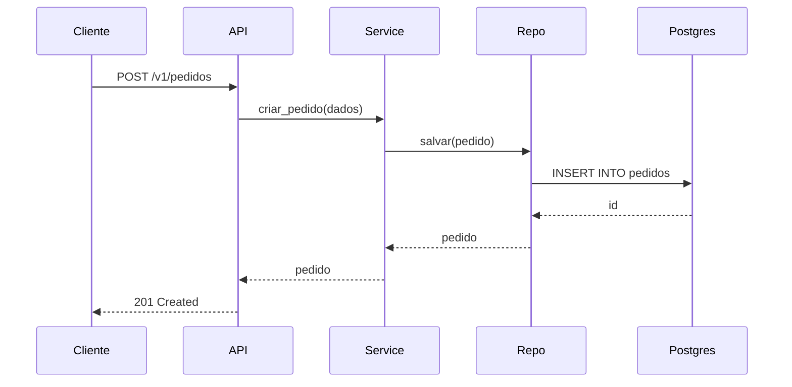
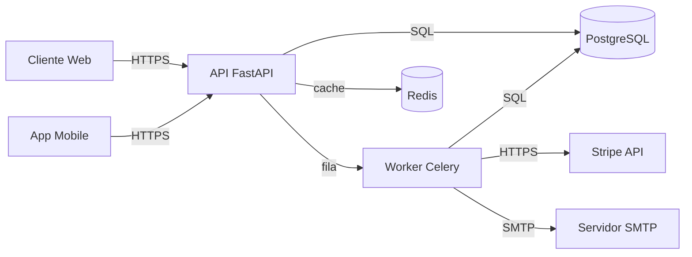

# Documentação — Arquitetura e Decisões

> **Aplica-se quando**: tomando decisões arquiteturais que impactam o projeto a longo prazo; criando ADRs (Architecture Decision Records); produzindo diagramas; estruturando `docs/` do repositório; ou escrevendo runbooks operacionais.
>
> Para README, CHANGELOG e commits, ver `40-doc-projeto.md`. Para docstrings, ver `11-python-estilo.md`.

## ADRs — Architecture Decision Records

ADR é o registro de **uma decisão arquitetural importante**: seu contexto, alternativas consideradas, decisão final, e consequências. Escrito **no momento da decisão**, **imutável depois de mergeado**.

### Quando criar ADR

Crie ADR para decisões que:

- Têm **impacto duradouro** (vão durar meses ou anos).
- Têm **alternativas razoáveis** que foram descartadas.
- Outros desenvolvedores vão **questionar depois** ("por que escolhemos X?").
- São **caras de reverter**.

**Exemplos legítimos:**

- Escolha de framework (FastAPI vs Django).
- Estratégia de persistência (ORM full vs SQL puro vs repositórios).
- Padrão de autenticação (JWT vs session vs OAuth).
- Layout de pastas e camadas.
- Estratégia de paginação (offset vs keyset).
- Decisão de monolito vs microserviços.
- Convenção de versionamento de API (`/v1/...` vs header).

**NÃO crie ADR para:**

- Decisões de implementação local (qual lib de log usar).
- Decisões revertíveis sem custo (cor do botão).
- Especificações de feature — isso é product/issue tracker.
- "Estilo" (snake_case vs camelCase) — vai em regra de estilo.

### Onde guardar

```
docs/adr/
├── README.md             # índice, status e datas
├── 0001-uso-de-fastapi.md
├── 0002-keyset-pagination-para-listagens.md
├── 0003-separacao-dominio-vs-orm.md
└── template.md           # modelo para novos ADRs
```

Numeração **sequencial**, padding com zeros (`0001`, `0002`, ..., `0042`). Mantém ordenação correta no `ls` por anos.

### Template

```markdown
# ADR 0001: Uso de FastAPI como framework HTTP

- **Status**: Aceito
- **Data**: 2026-03-15
- **Decisores**: time-backend

## Contexto

[Qual o problema? Por que precisamos decidir agora? Quais são as restrições
técnicas, de negócio, de tempo? Inclua dados se relevante (volume esperado,
SLA, integrações obrigatórias).]

## Decisão

[O que decidimos. Direto, sem rodeios.]

## Alternativas consideradas

### Django REST Framework
- ✅ Maduro, comunidade grande, batteries included.
- ❌ ORM forte demais para o desacoplamento que queremos.
- ❌ Async ainda é segundo cidadão.

### Flask + extensões
- ✅ Flexível, leve.
- ❌ Cada feature (validação, OpenAPI, async) requer escolher e configurar lib.
- ❌ Sem geração automática de OpenAPI.

### FastAPI [escolhido]
- ✅ Validação automática via Pydantic.
- ✅ OpenAPI gerado.
- ✅ Async nativo, performance.
- ❌ Time precisa aprender Pydantic v2 (curva inicial).
- ❌ Menos plugins prontos que Django.

## Consequências

### Positivas
- Documentação OpenAPI sempre atualizada (gerada do código).
- Validação na borda elimina checagens defensivas internas.

### Negativas
- Onboarding precisa cobrir Pydantic e Depends.
- Sem admin pronto (vamos precisar construir ou usar SQLAdmin).

### Neutras
- Migration do monolito Django existente requer adapter de URL/handlers.
```

### Status

ADR sempre tem um destes:

- **Proposto** — em discussão; vive em PR aberto. Raramente mergado neste status.
- **Aceito** — decisão vigente.
- **Rejeitado** — considerada e descartada. Mantida pelo valor histórico.
- **Substituído por ADR XXXX** — antiga, deprecated. O ADR novo aponta de volta com "Substitui ADR YYYY".

### Imutabilidade

ADR mergado **não é editado** depois (exceto correções de typo/formatação). Mudou de ideia?

1. Crie um **novo ADR** que supersede o anterior.
2. Atualize o **status do antigo** para "Substituído por ADR XXXX".
3. No novo, indique "Substitui ADR YYYY" e explique o que mudou.

Isso preserva o histórico de pensamento. `git blame` em ADR mantido mutável esconde a evolução.

### Índice em `docs/adr/README.md`

```markdown
# Architecture Decision Records

| #    | Título                                          | Status     | Data       |
| ---- | ----------------------------------------------- | ---------- | ---------- |
| 0001 | Uso de FastAPI como framework HTTP              | Aceito     | 2026-03-15 |
| 0002 | Keyset pagination para listagens                | Aceito     | 2026-03-22 |
| 0003 | Separação entre modelo de domínio e ORM         | Aceito     | 2026-04-10 |
| 0004 | Migração para PostgreSQL 17                     | Proposto   | 2026-05-01 |

Template em [template.md](template.md).
```

Atualizar o índice junto com o ADR no mesmo PR.

## Diagramas

### Quando usar

- **Componentes e suas relações** (visão geral de arquitetura).
- **Fluxo de dados** complexo entre 3+ atores.
- **Sequência temporal** importante (autenticação OAuth, two-phase commit, fluxo de checkout).
- **Modelos de dados** com relacionamentos não óbvios.
- **Máquinas de estado** (status de pedido, lifecycle de assinatura).

**NÃO use diagrama para:**

- Algoritmo simples (o código diz a mesma coisa).
- Estrutura de pastas (`tree` ou bullet list basta).
- Decisões pontuais (texto resolve).

### Formato: Mermaid (preferido)

Use **Mermaid** sempre que possível — renderiza nativamente no GitHub, GitLab, mkdocs, e fica em **texto** (versionável, diffable, editável sem ferramenta proprietária):

````markdown

````

Tipos suportados: `flowchart`, `sequenceDiagram`, `classDiagram`, `erDiagram`, `stateDiagram-v2`, `gitGraph`, `journey`, `gantt`.

### Quando Mermaid não cobre bem

Para deployment, infra detalhada, ou visualizações ricas:

- **draw.io / diagrams.net** — exporte como `.drawio.svg` (editável **e** renderizável no Markdown).
- **Excalidraw** — exporte como `.excalidraw.svg`.

**Evite** PNG/JPG sem arquivo fonte editável — a imagem fica órfã, ninguém atualiza.

### C4 Model para arquitetura geral

[C4 model](https://c4model.com) tem 4 níveis (Contexto, Container, Componente, Código). Para a maioria dos projetos, **Contexto + Container** bastam:

````markdown

````

### Diagramas envelhecem — defesas

- **Atualize no PR** que muda a arquitetura.
- **Datar** no canto do diagrama em arquitetura geral ("atualizado em YYYY-MM").
- **Revisar** em sprints de tech debt.
- **Texto sempre** (Mermaid, .drawio.svg) — PNG sem fonte vira lixo no dia seguinte.

## Estrutura de `docs/`

```
docs/
├── arquitetura/
│   ├── visao-geral.md             # C4 contexto + container, fluxos principais
│   ├── camadas.md                 # dominio/aplicacao/infra/api
│   ├── persistencia.md
│   └── diagramas/
│       ├── contexto.mmd
│       └── checkout-sequence.mmd
├── adr/
│   ├── README.md                  # índice
│   ├── template.md
│   ├── 0001-...
│   └── 0002-...
├── runbooks/                      # operação, troubleshooting
│   ├── deploy.md
│   ├── rollback.md
│   ├── investigar-latencia-alta.md
│   └── restaurar-backup.md
└── guias/                         # onboarding, processos
    ├── primeiros-passos.md
    └── fluxo-de-pr.md
```

Separação por **propósito**:

- `arquitetura/` — **como o sistema é**.
- `adr/` — **por que o sistema é assim**.
- `runbooks/` — **como operar o sistema**.
- `guias/` — **como trabalhar no projeto**.

## Documentação como código — mkdocs

Para projetos com documentação maior, considere site gerado:

- **mkdocs + Material** — mais simples, Markdown puro. **Recomendado para a maioria.**
- **Sphinx** — mais poderoso, com cross-references e suporte a docstrings Python. Use se for **biblioteca Python publicável** ou se precisar de referência cruzada complexa.

`mkdocs.yml` mínimo:

```yaml
site_name: Meu Projeto
site_url: https://docs.example.com
repo_url: https://github.com/org/projeto

theme:
  name: material
  features:
    - navigation.tabs
    - navigation.sections
    - content.code.copy

nav:
  - Início: index.md
  - Arquitetura:
    - Visão geral: arquitetura/visao-geral.md
    - Camadas: arquitetura/camadas.md
  - ADRs:
    - Índice: adr/README.md
  - Runbooks: runbooks/
  - Guias: guias/

plugins:
  - search

markdown_extensions:
  - admonition
  - pymdownx.superfences:
      custom_fences:
        - name: mermaid
          class: mermaid
          format: !!python/name:pymdownx.superfences.fence_code_format
```

Publique em GitHub Pages, Cloudflare Pages, ou similar via CI.

### Quando vale a pena montar site

- Time grande (10+ devs) com onboarding constante.
- API pública ou produto com consumidores externos.
- Documentação ultrapassa ~20 arquivos.

Em projeto pequeno, README + `docs/` em Markdown puro é suficiente — o GitHub renderiza bem o que importa.

## Runbooks operacionais

Documentação para **quem opera** o sistema (resolver incidentes, deployar, monitorar). Audiência diferente de docs de arquitetura — pode ser SRE/ops sem contexto profundo do código.

### Estrutura típica de runbook

```markdown
# Investigar Latência Alta na API

## Sintomas

- P99 > 2s no endpoint `/v1/pedidos`.
- Alerta `api-latency-high` disparado em Datadog.

## Diagnóstico rápido

1. Verificar dashboard: <https://app.datadoghq.com/dashboard/abc-123>
2. Conferir se há deploy recente: `git log --since="2 hours ago"`.
3. Rodar query no Datadog Logs:
   ```
   service:api status:error @duration:>2000
   ```

## Causas comuns

### DB sobrecarregado
**Sintoma adicional**: queries lentas no slow query log.

**Mitigação**:
1. Verificar locks: query `SELECT * FROM pg_locks WHERE granted = false;`.
2. Considerar matar query lenta: `SELECT pg_terminate_backend(pid);`.

### Dependência externa lenta
**Sintoma adicional**: traces mostram tempo em `httpx`/`stripe`.

**Mitigação**:
1. Aumentar timeout temporariamente via feature flag.
2. Ativar circuit breaker se disponível.

## Pós-incidente

- Abrir issue documentando causa raiz.
- Postmortem obrigatório se P0/P1.
- Atualizar este runbook se descobriu cenário novo.
```

### Princípios de runbook

- **Achatados, copy-pasteáveis** — sem prosa, sem rodeios.
- **Comandos exatos** — não "verifique os logs", mas a query específica.
- **Links diretos** para dashboards, queries salvas, painéis.
- **Atualizado pós-incidente** — todo postmortem revisita o runbook.

## O que NÃO documentar

- **Comportamento óbvio** — `obj.id` é o ID, não precisa de docstring.
- **Detalhes de implementação interna** — vão estar desatualizados rápido.
- **Cada classe/função privada** — cobertura defensiva vira ruído.
- **Coisas que ainda não foram decididas** — "TODO: decidir como X" não é documentação.
- **Auto-explicação** — comentário/doc que repete o código sem agregar contexto.

## Anti-padrões

- ❌ ADR escrito **depois** que a decisão foi implementada (vira "post-hoc rationalization", sem alternativas reais consideradas).
- ❌ ADR editado depois de mergado para refletir mudança — quebra o histórico. Crie novo ADR.
- ❌ ADR sem seção de **alternativas** — não é decisão, é declaração.
- ❌ ADR para decisão trivial — desvaloriza ADRs sérios.
- ❌ ADRs sem índice em `docs/adr/README.md` — viram lista impossível de navegar com o tempo.
- ❌ Diagrama PNG/JPG sem arquivo fonte editável.
- ❌ Diagrama desatualizado mantido no repo (pior que não ter diagrama).
- ❌ Mermaid em arquivo `.mmd` separado sem ser incluído em nenhum .md.
- ❌ Runbook genérico ("verificar logs", "investigar") sem comandos específicos.
- ❌ Documentação que cita código por número de linha (envelhece imediatamente).
- ❌ `docs/` enorme em projeto que ninguém lê — sinal de overengineering de documentação.
- ❌ mkdocs sem deploy em CI — site nunca atualizado fica pior que ausente.
- ❌ Documentação só na cabeça do dev sênior — bus factor 1.
